# CTC

# 1.细胞识别算法思路
01_CTC_detection_pipeline.py 
输入图片：三个通道（明场DIC、DAPI（蓝色，细胞核质）、CD45（黄色））
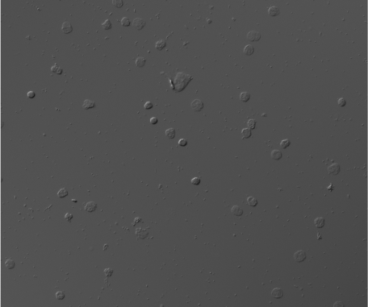
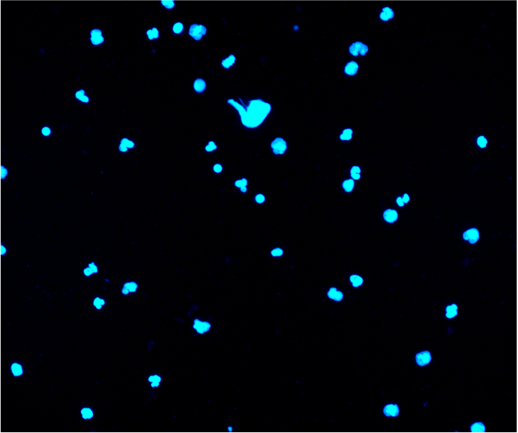

---------------------
1. 预处理（函数preprocessing）。图像由于光照强度不同，细胞密度不同，需要做预处理。

1). 彩色图改成灰度图。 
2). 图像均衡，采用自适应图像均衡，或者直接增强图像对比度。 
3). 去除噪声，平滑图像。 

2. 初步识别细胞（函数segmentation\_gradient）。

1). 明场通道：计算出图像的梯度，再对梯度阈值化，就能知道细胞大概的位置。 
2). 蓝色细胞核通道：自适应阈值二值化，就能大概得到细胞的位置。再做分水岭算法分割粘连细胞。 

3. 初步校正明场和荧光的偏移（函数adjust\_img\_ovelap）。

根据上一步的初步识别的结果，得出明场细胞的大概位置和蓝色荧光通道大概的细胞位置，根据这两个结果，随机抽取几十个细胞，逐渐平移图像，直到两个通道的细胞重叠面积最大。

4. 准确识别（函数segmentation\_diff）。

1). 蓝色荧光通道：同2.2) 
2). 明场通道：根据步骤1得到的图像平滑并且增强对比度之后的图片，提取图片的背景（通过80\*80平均滤波器），将图片和该图片的背景做差，再阈值化，得到比背景暗和背景亮的区域，此时得到细胞的轮廓。将细胞核的二值化结果加上背景差二值化的结果，就是整个细胞的识别结果。

5. 进一步做粘连细胞分割（函数re\_segmentation）。

根据沃罗诺伊图 (Voronoi diagram)算法，一个细胞核一个点，将这些点镶嵌在不重叠的多边形中，这些多边形的边就是粘连细胞的分割线，从而将明场通道粘连的细胞根据它们的细胞核位置切开。（该步骤调用了R语言的包EBImage）

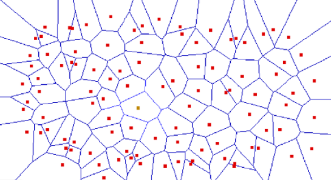

_Figure 1 Voronoi diagram_

6. 再次校正明场和荧光的偏移（函数adjust\_img\_center）。

此时明场通道和荧光通道仍然可能有偏移。根据步骤5识别出来的结果，知道明场通道识别出来的细胞的位置，和荧光通道识别出来的细胞核的位置，它们此时是一一对应的，如果有偏移，它们的中心不重叠。所以校正的方法就是，同时在两张图上抽取一点数量的细胞，计算它们的中心位置的平均差，用这个差来对明场图像做平移。

7. 最后的识别（再次调用函数segmentation\_diff和re\_segmentation）

由于步骤6对明场通道和荧光通道的位置做了最后的校正，细胞识别需要再做一次，因为明场通道的识别用到了荧光通道的信息。

8. 计算黄色通道荧光值（函数yellow）

1). 矫正背景噪声:背景提取(80\*80平均滤波器。80这个值应该根据图片大小做调整，80适用于2400\*2400的图像)，将图片与该图片的背景做差，得到校正后的荧光值。用步骤7的结果，计算出每个细胞核内荧光强度平均值（细胞核的识别更准确，也可以用细胞的识别结果） 

2). 根据细胞大小，细胞核大小，黄色通道荧光值，判断是否为CTC。在这之前，需要确定各个参数的分布，根据分布来计算P-值，或其他衡量指标。（函数CTC） 

识别结果：（蓝色为细胞核，绿色为细胞质。每个部分都可以获得其基本信息：大小，圆度等）
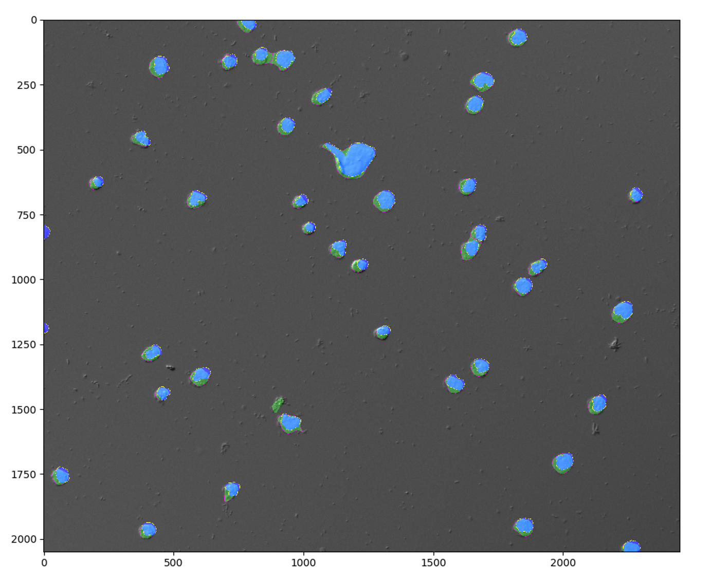

更多详情参见:./PPT/Multi-Channel Cell Segmentation introduction.pptx

#2. 根据样本的分布估计CTC阈值
02_estimate_distribution.py 
我们需要区分：正常细胞（血液中的白细胞及其他细胞），和CTC（肿瘤细胞），而它们混合在样本中，但它们的分布不同。
用高斯混合分布估计分别估计出这两种成分的分布，来计算p-value或贝叶斯因子。

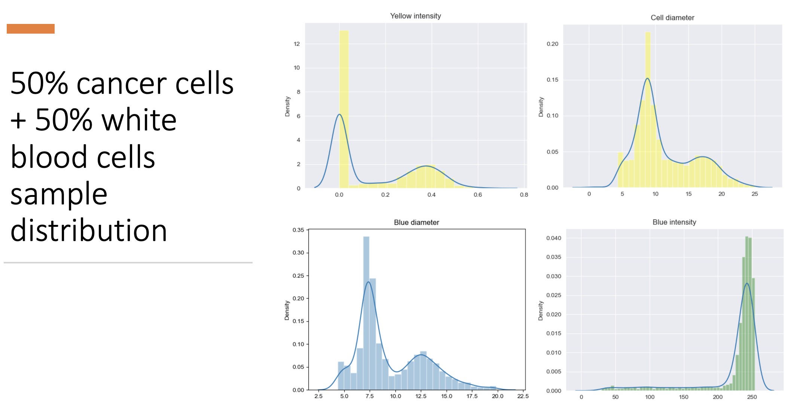
---------------------
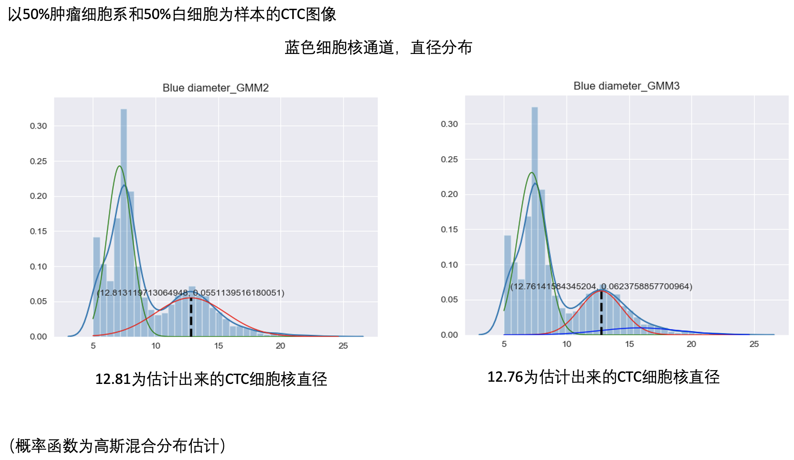

---------------------
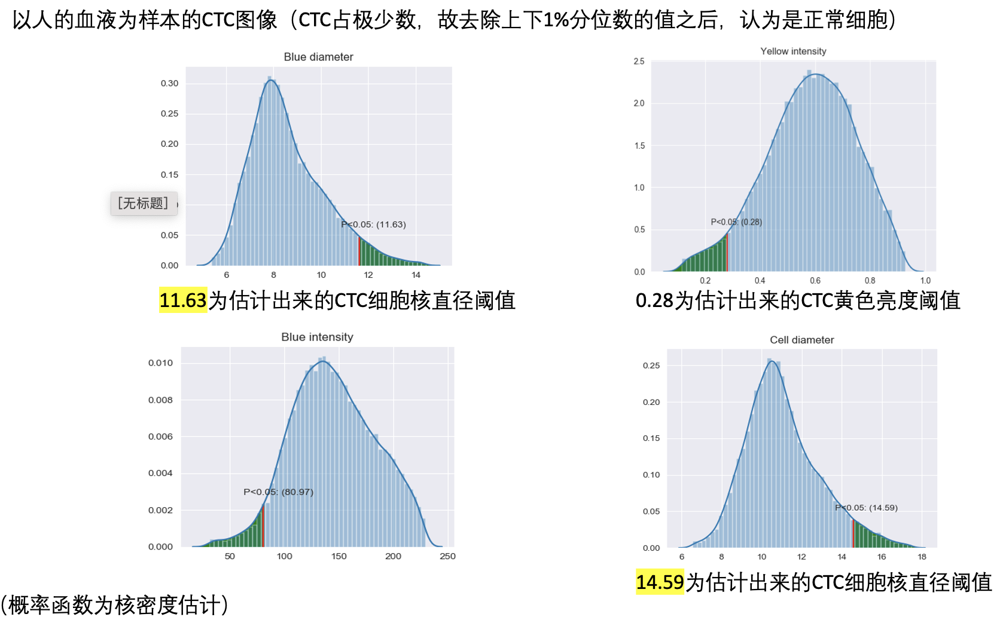

---------------------
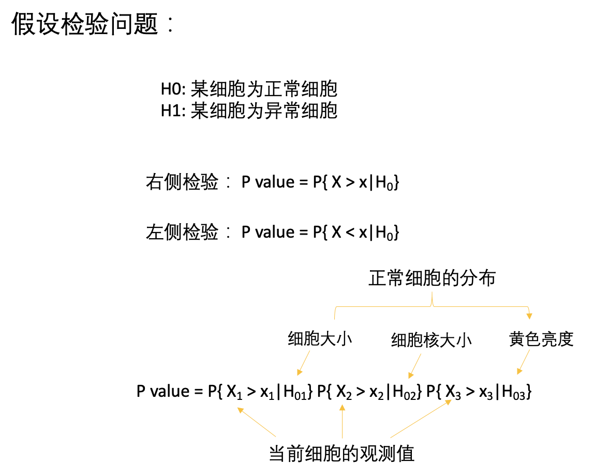

---------------------
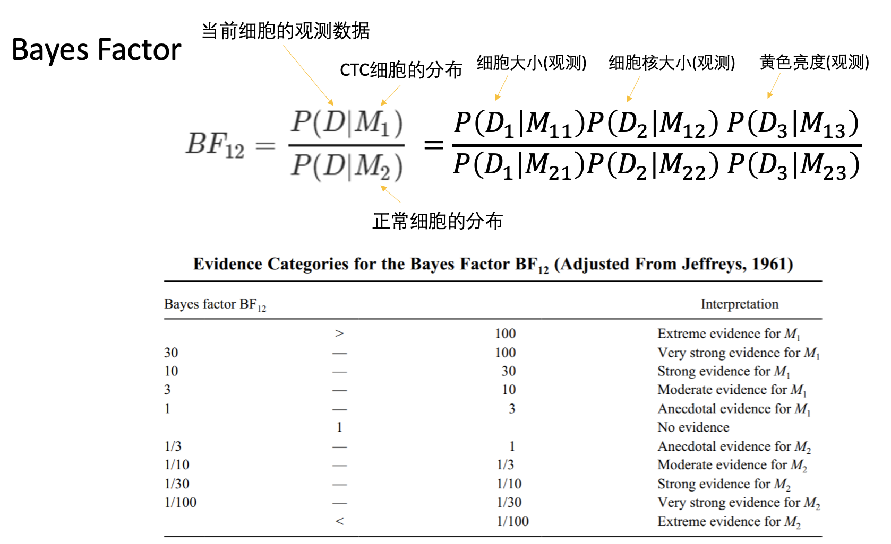

---------------------
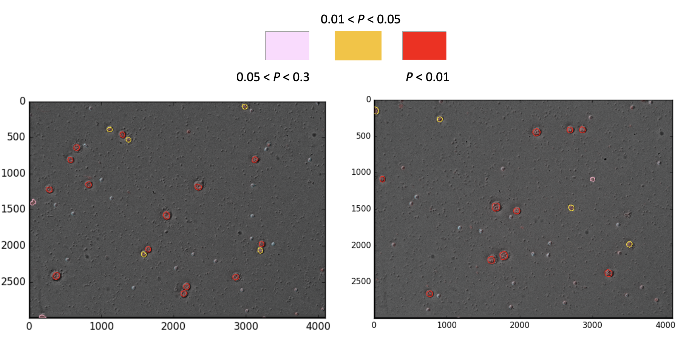
---------------------

更多详情参见:./PPT/CTC_cutoff_estimate.pptx

# 3. Circulating Tumor Cell Detection Research Proposal

## Introduction

The incidence rate of cancer in China is lower, but the fatality rate is higher than America and Britain [1]. Although treatments of cancer are more and more comprehensive and matured, cancer early detection plays an important role in increasing the survival rate and preventing people from part of the torturous treatments. The early screening of breast cancer reduce around 20% of the mortality rate [2].

There are lots of widely used screening method, such as mammography for breast cancer, gastrointestinal endoscopy for gastric cancer and colon cancer, and Pap test for cervical cancer [3]. However, each of these traditional tests could only detect one kind of cancer at a time, which is costly and excruciating if people want to do them all.

Liquid biopsy has the advantages of non-invasive and able to detect multi-cancers by one test. Even in the early stage of primary tumor, it releases cells or DNA fraction into blood, and they travel over the body, so they are called circulating tumor cells (CTC) and circulating tumor cell-free DNAs (cfDNA) [4]. As a result, by detecting the circulating tumor cfDNA and CTC in the peripheral blood and localizing the original of them, multi-cancer detection with high specificity of more than 99% is possible [5,6]. The combination of CTC and cfDNA provides around 95% sensitivity [7].

In order to popularize the cancer early screening among high risk people, the efficiency is the key. The economic, high specificity and sensitivity detection methods are more acceptable and have higher probability of widespread application [8]. Nowadays, the CTC detection method is based on enrichment of CTC and distinguish CTC from white blood cells (WBCs) according to the cell size, nucleus size, and cell surface antigens such as the epithelial cell adhesion molecule (EpCAM) and lymphocyte common antigen (CD45) [9]. CTC should have larger cell size and nucleus size, and CD45 negative. To visualize the characters of cells, bright field (BF) microscope image is used to visualize the size of cells, and 4′,6-diamidino-2-phenylindole (DAPI) is used to staining the nucleus size. However, the quantification of CTC manually is time-consuming and labor-intensive, which takes around 40 minutes for one patient.

To improve the efficiency of CTC detection, we propose an automatic CTC detection and counting method based on those visualization microscope images, not only speed up the detection but also promote the accuracy of the detection. Besides, the confirmation of CTC lack of gold standard, so we also aim to discovery the optimal threshold and estimate the sensitivity and specificity and take breast cancer as example.

## Primary Results

According to different kinds of fluorescence staining images, we have developed a cell detection algorithm, which can automatically detect every cell in the images and quantify the size, shape, and signal brightness of each cell. To make it easily access, we develop a web tool in which user can upload their own images to detect and quantify the cell. Besides, based on the characteristics obtained, we estimated the statistical significance of various threshold of CTC. So far, we have collected 123 cases of breast cancer patients in different stages.

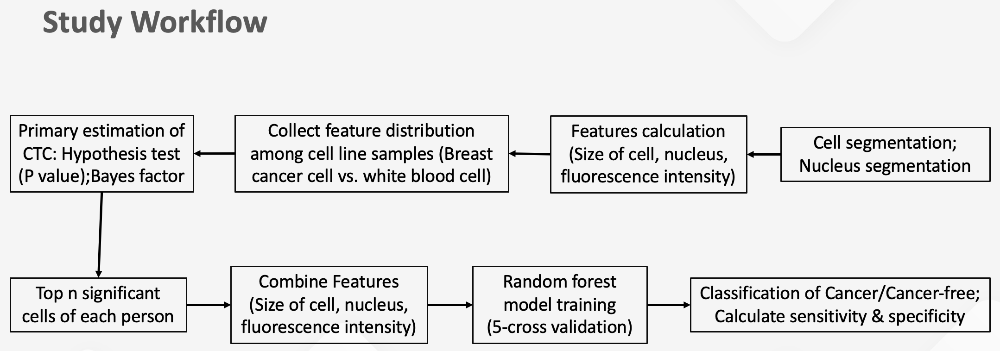
## Material Requirement

However, to estimate the sensitivity and specificity, we need to collect 100 cases of healthy women with the same age distribution of cancer group, shown in Table 1, to do the CTC testing. For the healthy control group people, they should not have severe disease, especially the disease that related to cancer. For each participant, we would only need to collect 400_ml_ peripheral blood.

_Table 1 The age distribution requirement of 100 healthy control cases._

| **Age** | **Gender** | **Percentage** | **Number of cases** |
| --- | --- | --- | --- |
| \<30 | 女 | 1.14% | 1 |
| 30-50 | 女 | 51.72% | 52 |
| 50-70 | 女 | 42.53% | 43 |
| \&gt;70 | 女 | 4.60% | 4 |

More details:
./PPT/Blood liquid biopsy based on circulating tumor cells .pptx

## References

1 Feng, R.-M., Zong, Y.-N., Cao, S.-M. &amp; Xu, R.-H. Current cancer situation in China: good or bad news from the 2018 Global Cancer Statistics? _Cancer Communications_ **39** , 22 (2019).

2 Myers, E. R. et al. Benefits and harms of breast cancer screening: a systematic review. Jama 314, 1615-1634 (2015).

3 Smith, R. A. et al. Cancer screening in the United States, 2017: a review of current American Cancer Society guidelines and current issues in cancer screening. CA: a cancer journal for clinicians 67, 100-121 (2017).

4 Alix-Panabières, C. &amp; Pantel, K. Clinical applications of circulating tumor cells and circulating tumor DNA as liquid biopsy. Cancer discovery 6, 479-491 (2016).

5 Liu, M. et al. Sensitive and specific multi-cancer detection and localization using methylation signatures in cell-free DNA. Annals of Oncology (2020).

6 Nimgaonkar, A. et al. (American Society of Clinical Oncology, 2018).

7 MOON, S. M. et al. Clinical Utility of Combined Circulating Tumor Cell and Circulating Tumor DNA Assays for Diagnosis of Primary Lung Cancer. Anticancer Research 40, 3435-3444 (2020).

8 Council, N. R. Fulfilling the potential of cancer prevention and early detection. (National Academies Press, 2003).

9 Gupta, P. et al. Analytical validation of the CellMax platform for early detection of cancer by enumeration of rare circulating tumor cells. Journal of Circulating Biomarkers 8, 1849454419899214 (2019).

####